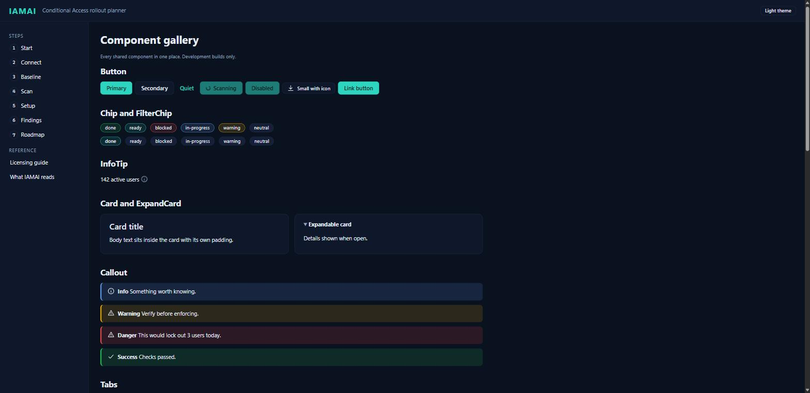
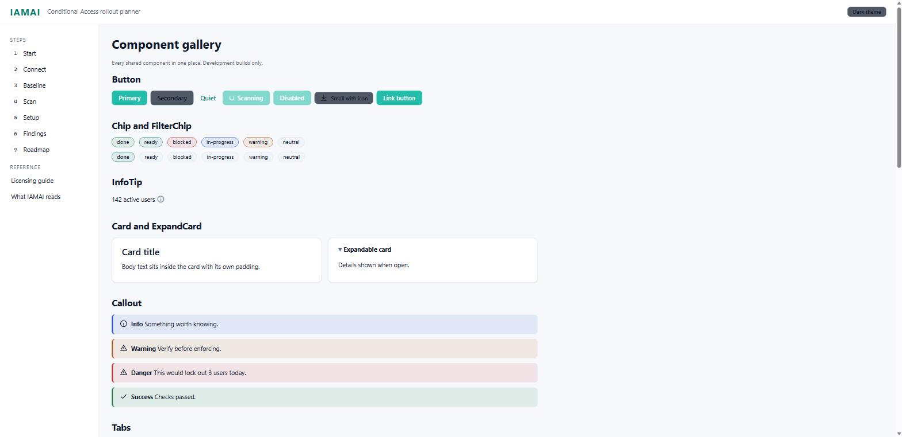
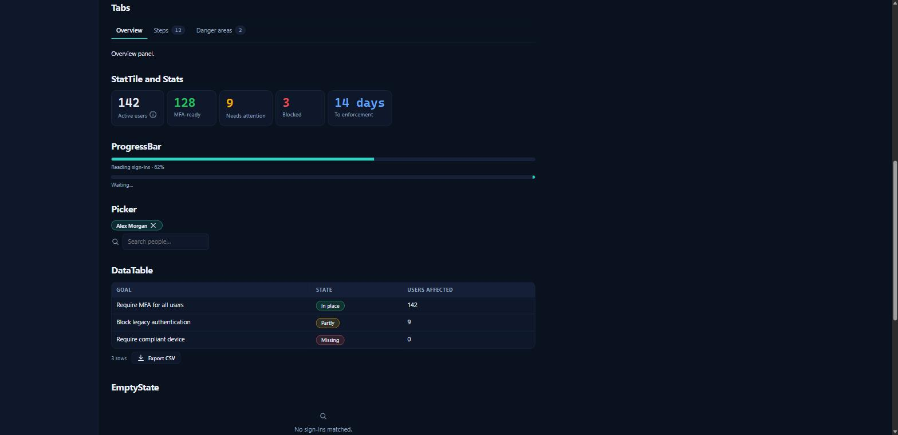
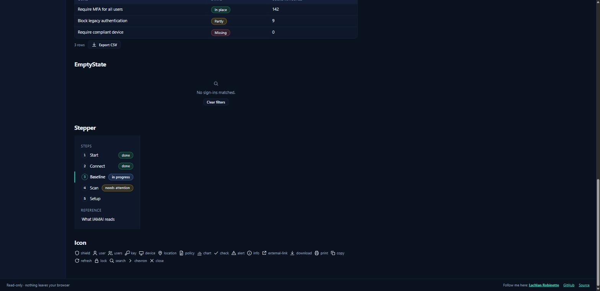

# Component library (design system v2)

Source of truth: `src/ui/tokens.ts` (palette, type scale, spacing, radii) mirrored into
`src/ui/tokens.css`; components live in `src/ui/components/` and are exported from
`src/ui/components/index.ts`. Every page composes these — bespoke markup for anything a
component covers is a defect (CLAUDE.md UX rules).

Contrast is enforced by `src/ui/tokens.test.ts`: body text on every surface ≥ 4.5:1,
accent button ink ≥ 4.5:1, status colours ≥ 3:1, in both themes. The light accent is
`#0B7F72` rather than the proposed `#0F9F8F` because the latter fails AA for white ink.

## Gallery

The dev-only route `#/components` (development builds only; production shows Start)
renders every component in every state. Screenshots below were taken from it at
1280 px wide; re-take them after any visual change.

| | |
|---|---|
|  |  |
|  |  |

## Components

| Component | Props (essentials) | Used on |
|---|---|---|
| `Button` / `LinkButton` | `variant` primary·secondary·quiet, `size` md·sm, `loading`, `icon`, `disabled` | every page |
| `Chip` | `status` done·ready·blocked·in-progress·warning·neutral | Scan, Setup, Findings, Roadmap, Licensing, Stepper |
| `FilterChip` | `selected`, `onToggle` | Scan filters, Setup (locations, frameworks), Roadmap filters and step tabs |
| `InfoTip` | `title`, `text` — ⓘ popover, keyboard + Esc + click-outside | every number a user sees (`src/copy/definitions.ts`) |
| `Card` / `ExpandCard` | `title`; `summary`, `open` | Start, Connect, Baseline, Setup, Findings, Roadmap |
| `Callout` | `kind` info·warning·danger·success, `title` | Baseline, Scan, Setup, Findings, Roadmap |
| `Tabs` | `tabs: TabDef[]` (`id`, `label`, `badge`, `render`); print renders all panels | Findings, Roadmap |
| `StatTile` / `Stats` | `value`, `label`, `tone`, `tip`, `onClick`, `active` | Scan, Findings |
| `ProgressBar` | `percent` (null = indeterminate), `caption` | Scan |
| `Picker` | `selected`, `options`, `suggestions`, `onSearch`, `onChange`, `single` | Setup (users, groups) |
| `DataTable` | `columns: Column<T>[]` (sortable, `csv`, `hidden` CSV-only), `expand`, 50/page, `csvName` | Scan, Licensing, What IAMAI reads |
| `EmptyState` | `icon`, `text`, `action` | tables with no rows |
| `Stepper` | `steps`, `reference`, `active` — status chips; horizontal under 900 px | app shell |
| `Icon` | `name` (20 names), `size` — 20 px grid, 1.5 px stroke, no emoji | throughout |

## Shell fixes shipped with v2

- Header shows the tenant **name** only; the tenant ID and signed-in account are in the
  hover tooltip.
- Footer: "Read-only · nothing leaves your browser" on the left, links on the right.
- No horizontal overflow at 1280 px (checked: `scrollWidth ≤ innerWidth` on the gallery).
